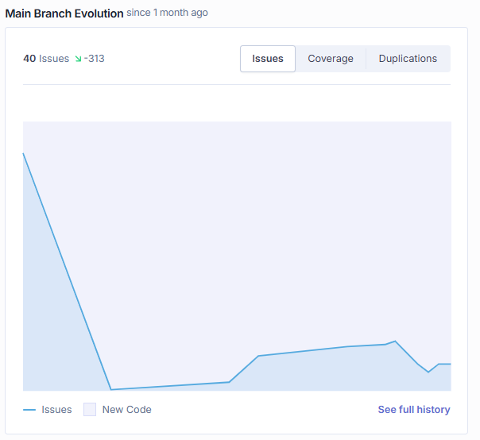

RETROSPECTIVE 4 (Team 3)
=====================================

The retrospective should include _at least_ the following
sections:

- [process measures](#process-measures)
- [quality measures](#quality-measures)
- [general assessment](#assessment)

## PROCESS MEASURES 

### Macro statistics

- Number of stories committed 7 vs done 7
- Total points committed 58 vs done 58
- Nr of hours planned 96h vs spent 100h 30m 

**Remember**  a story is done ONLY if it fits the Definition of Done:
 
- Unit Tests passing 722
- Code review completed 7
- Code present on VCS
- End-to-End tests performed 56

> Please refine your DoD 

### Detailed statistics

| Story  | # Tasks | Points | Hours est. | Hours actual |
|--------|---------|--------|------------|--------------|
| _#0_   |    3    |    -   |     14     |      14      |
|   28   |    6    |    3   |      7     |       8      |
|   27   |    7    |   13   |     10     |      10      |
|   30   |    8    |   13   |    12,5    |      14,5    |
|  10bis |    8    |    5   |     9,5    |      10,5    |
|   11   |   10    |   13   |    15,5    |      16      |
|   12   |    8    |   13   |    19,5    |      19,5    |
|   13   |    8    |    5   |      8     |       8      |
   

> place technical tasks corresponding to story `#0` and leave out story points (not applicable in this case)

- Hours per task (average, standard deviation)

|            | Mean | StDev |
|------------|------|-------|
| Estimation | 1,65 |  1,47 | 
| Actual     | 1,73 |  1,50 |

- Total task estimation error ratio: sum of total hours estimation / sum of total hours spent -1 = 0,047

  $$\frac{\sum_i spent_{task_i}}{\sum_i estimation_{task_i}} - 1$$

  
## QUALITY MEASURES 

- Unit Testing:
  - Total hours estimated 8,5
  - Total hours spent 8,5
  - Nr of automated unit test cases  722
  - Coverage (if available) 87,8%
- E2E testing:
  - Total hours estimated 6,5
  - Total hours spent 6,5
- Code review: 
  - Total hours estimated 7,5
  - Total hours spent 8,5
- Technical Debt management:
  - Strategy adopted: we decide to obtain at least grade A across all analysis sections and focus on items with high impact.
  - Total hours estimated at sprint planning 10 h
  - Total hours spent 10 h
  
  

## ASSESSMENT

- What caused your errors in estimation (if any)?
  
  Our estimation error was very low this sprint (around 4%). This minor discrepancy was mainly due to a misunderstanding of the effort required for User Story 10bis as you can see in the low number of history points we gave to it. Initially, we understood only to allow admins to change technical officer roles; however, during the sprint, we realized technical users needed to support multiple roles, which led to a significant backend refactor.

- What lessons did you learn (both positive and negative) in this sprint?

  Positive: We learned how to improve our task allocation and role division, which significantly reduced dependencies. This allowed team members to work more independently without having to wait for others to finish their tasks the most of the time. 

  Negative (Velocity Trade-off): We learned to not overstimate the time that we have available. In this sprint we start to work hard a bit too late so in the last days the effort was higher than estimated. 

- Which improvement goals set in the previous retrospective were you able to achieve? 

  "Estimation and organization of the technical tasks": In this sprint, we spent more time and more carefully, trying to give greater depth to technical tasks and technologies we weren't familiar with, such as the Telegram environment. This was all done from the initial planning stage and was then maintained by everyone individually and as a team throughout the sprint. 

  "Balance Technical Debt vs. New Features": In the last sprint, we aimed for a better ratio between technical debt mitigation and new feature development. We achieved good SonarQube metrics with relatively low effort, which allowed us to complete more stories than in previous sprints.

- Which ones you were not able to achieve? Why?

  We struggled more with time management compared to Sprint 3. We didn't take full advantage of the longer duration of this sprint; as a result, the workload in the final week was much heavier than expected.    

- One thing you are proud of as a Team!!

  We are proud of successfully completing the project, consistently delivering all planned stories without bugs during our demos. Throughout the semester, we maintained great team chemistry; despite some initial differences in our working styles, we collaborated effectively to find the best solutions for everyone.